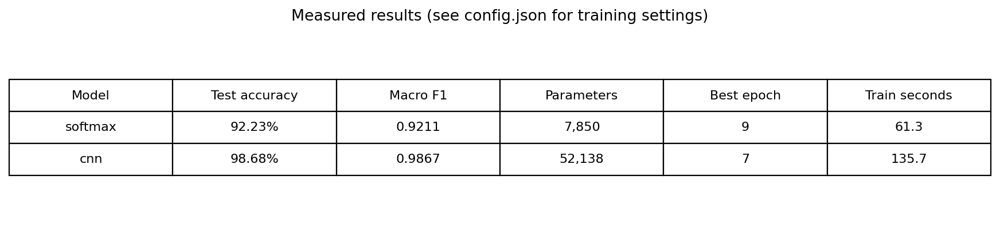

# Báo Cáo Phân Loại MNIST: Softmax vs CNN

Dự án này thực hiện phân loại tập dữ liệu chữ số viết tay MNIST (0-9) bằng hai cách tiếp cận: một mô hình học máy truyền thống (Softmax) và một mô hình học sâu hiện đại (CNN).

---

## 1. Giới thiệu Mô hình

### Softmax Classifier (Mô hình Tuyến tính)
- **Cơ chế:** Duỗi ảnh 2D ($28 \times 28$) thành vector 1D ($784$ chiều), sau đó nhân với ma trận trọng số và dùng hàm Softmax để tính xác suất.
- **Đặc điểm:** Hoạt động như một lớp Fully Connected duy nhất. Quá trình huấn luyện tính toán gradient hoàn toàn thủ công.
- **Ưu điểm:** Cấu trúc cực kỳ đơn giản, huấn luyện nhanh.
- **Nhược điểm:** Phá vỡ cấu trúc không gian của ảnh, không nhận diện được các đặc trưng cục bộ (nét cong, góc cạnh).

### CNN (Mạng Nơ-ron Tích chập)
- **Cơ chế:** Giữ nguyên định dạng 2D của ảnh, sử dụng các bộ lọc (kernel) trượt qua ảnh để trích xuất đặc trưng thông qua các lớp Convolution và Max Pooling.
- **Đặc điểm:** Sử dụng cơ chế tự động tính đạo hàm (autograd) của PyTorch.
- **Ưu điểm:** Bắt được các đặc trưng không gian phức tạp (hình dáng nét chữ), bất biến với sự dịch chuyển nhẹ. Độ chính xác vượt trội.
- **Nhược điểm:** Tốn kém tài nguyên tính toán hơn do có nhiều tham số.

---

## 2. So sánh Kết quả (Trực quan hóa)

### 2.1. Hiệu suất tổng quan
Mô hình CNN cho thấy sự vượt trội hoàn toàn về cả Độ chính xác (Accuracy) lẫn chỉ số F1 (Macro F1) trên tập kiểm tra.

### 2.2. Quá trình Hội tụ (Learning Curves)
- **CNN:** Hội tụ rất nhanh chỉ sau vài epoch đầu tiên, loss giảm mạnh và ổn định.
- **Softmax:** Cần nhiều thời gian (epoch) hơn để hội tụ và độ chính xác có xu hướng chững lại sớm (underfitting nhẹ) do giới hạn của mô hình tuyến tính.

### 2.3. Hiệu suất trên từng chữ số (F1-Score)
So sánh chỉ số F1 cho thấy CNN hoạt động tốt và đồng đều trên mọi chữ số (gần đạt 1.0). Softmax thường gặp khó khăn với các số có nét viết dễ nhầm lẫn (ví dụ: 4 và 9, 5 và 3).

### 2.4. Ma trận nhầm lẫn (Confusion Matrices)
- **CNN:** Các dự đoán tập trung gần như tuyệt đối vào đường chéo chính (đúng nhãn).
- **Softmax:** Xuất hiện nhiều vùng màu bên ngoài đường chéo, cho thấy sự nhầm lẫn có tính hệ thống giữa các cặp số cụ thể.

---

## 3. Phân tích Lỗi (Error Analysis)

Việc quan sát các mẫu dự đoán sai giúp hiểu rõ giới hạn của từng mô hình:

- **Softmax sai, CNN đúng:** Đây thường là các chữ số viết hơi lệch, méo hoặc thiếu nét. CNN nhận diện được nhờ trích xuất đặc trưng cục bộ, trong khi Softmax bị nhiễu do điểm ảnh thay đổi vị trí.
  
  

- **Cả hai cùng sai:** Đây thường là các mẫu bị viết quá cẩu thả, biến dạng nặng nề hoặc giống một ký hiệu khác hoàn toàn (ngay cả mắt người cũng khó nhận ra).
  
  

*(Tùy chọn: Bạn có thể xem thêm các trường hợp đặc biệt hiếm hoi khi `Softmax đúng, CNN sai` tại file `results/comparison/softmax_correct_cnn_wrong.png`).*